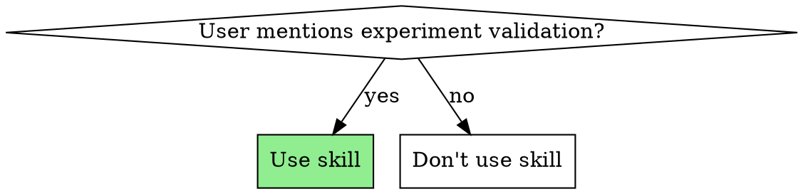
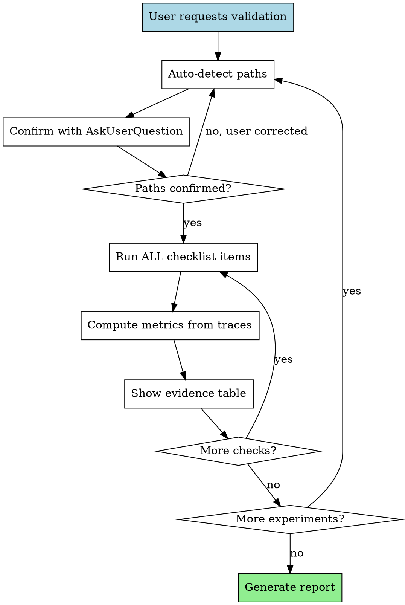

# BLIS ORC Campaign Validation

## Overview

Validates BLIS **ORC (Observe-Replay-Calibrate)** campaign experiment results against their specifications. Performs comprehensive parity checks between:
- **Workload spec** (observe/workload.yaml) vs **actual trace** (observe/data.csv)
- **vLLM config** (experiments.json) vs **actual server logs** (vllm.log)
- **Runtime health** (server logs, request distribution, errors, KV offload activity)

**Scope:** ORC harness experiments only (experiments with `"harness": "orc"` in experiments.json). For inference-perf experiments, use a different validation approach.

**Core principle:** Evidence-based validation. Every check must show expected vs actual with sources.

## When to Use



**Use when:**
- "Validate ORC experiment #73"
- "Check if ORC experiment matched spec"
- "Did the observe trace match workload?"
- "Verify vLLM config for ORC experiments 68-72"
- "Sanity check this ORC benchmark run"

**Don't use for:**
- Non-ORC experiments (inference-perf harness uses different structure)
- Analyzing simulation results (use BLIS replay/calibrate tools)
- Comparing two experiments (different workflow)
- Performance debugging (use observability tools)

## Operating Constraints

**STRICTLY READ-ONLY** for experiment data. Do not modify any experiment files.

**Validation Scripts**: If you need to generate analysis scripts (Python, shell, etc.), store them in `.orc-validation/` folder at the repository root:
- Check if `.orc-validation/` exists, create if needed
- Before generating a script, check if it already exists in `.orc-validation/`
- Reuse existing scripts when possible (they may have been refined)
- Only create new scripts or update existing ones if necessary
- Scripts in this folder are for validation purposes only, not part of the experiment data

Example structure:
```
.orc-validation/
  analyze_cohorts.py         # Per-cohort workload analysis
  config_validation.py       # vLLM config checking
  analyze_priority.py        # Priority scheduling validation
  analyze_runtime.py         # Runtime metrics
```

## Workflow



**Key points:**
- Path confirmation happens BEFORE any checks
- Each experiment gets independent path detection
- ALL checklist items run (no shortcuts)
- Evidence tables for EVERY check (no exceptions)
- Multi-experiment = loop back with full rigor

## Evidence Requirements

For EVERY check, show:

1. **What you checked** — plain English, one sentence
2. **Expected** — value from spec (source: file, field)
3. **Actual** — value from trace/logs (source: file, how computed)
4. **Verdict** — PASS / WARN / FAIL
5. **Why** — if WARN/FAIL, explain meaning and what to do

Example:
```markdown
**1a. Arrival Rate** — PASS
Expected 20 req/s (from workloads.yaml:general.load.stages[1].rate)
Measured 20.1 req/s (3612 requests over 179.7s in per_request_metrics.csv)

| Metric | Spec | Actual | Diff | Verdict |
|--------|------|--------|------|---------|
| QPS | 20.0 | 20.1 | +0.5% | PASS |
```

## Step 0: Auto-Detect and Confirm Paths

Before ANY checks, auto-detect paths and confirm with user.

### Auto-Detection Strategy

1. **Experiment directory**: Look for `campaign/{id}-{model}-{hw}-{workload}/` under working directory
2. **Run directory**: `{experiment_dir}/data/{id}-{model}-tp{N}-{workload}-{instance}-{attempt}/`
3. **Trace file**: `{run_dir}/observe/data.csv` (ORC format)
4. **Server log**: `{run_dir}/vllm.log` (at run directory root)
5. **Workload spec**: `{run_dir}/observe/workload.yaml` (included with trace)
6. **Trace header**: `{run_dir}/observe/header.yaml` (contains server config summary)
7. **Experiment config**: `experiments.json` in repository or `{experiment_dir}/experiment.json`

**Example structure:**
```
campaign/73-codellama-34b-h100-codegen/
  data/
    73-codellama-34b-tp2-codegen-2-1/
      vllm.log              ← vLLM server log (check startup config here)
      observe/
        data.csv            ← Request trace (compute metrics from this)
        header.yaml         ← Trace metadata (server type, model)
        workload.yaml       ← Workload spec (expected values)
      replay/               ← Replay results (optional)
      results/              ← Analysis results (optional)
```

Use Glob and Bash to find candidates. Then use AskUserQuestion:

```
I found the following paths. Please confirm or correct:

Experiment dir:  <detected or "not found">
Trace file:      <detected or "not found">
Workload spec:   <detected or "not found">
Experiment config: <detected or "not found">
Experiment ID(s): <detected>
```

**Do NOT proceed until confirmed.**

## Checklist

Run ALL checks below.

**IMPORTANT: Workload Format Detection**
- **inference-perf format**: Has `inference_perf:` top-level key with `load.stages[]` structure
- **BLIS native format**: Has `cohorts:[]` top-level array with per-cohort distributions
- Use appropriate validation approach based on detected format

**CRITICAL: BLIS Native Cohort Workloads - Gamma Parameters**
- The `cv` field in `arrival:` section is **METADATA ONLY** - DO NOT validate against it
- The `scale` field in `arrival:` section is **METADATA ONLY** - DO NOT validate against it
- **BLIS actual behavior**:
  - Reads: `arrival.shape` and `spike.trace_rate`
  - Ignores: `arrival.cv` and `arrival.scale`
  - Calculates: `scale = (1/trace_rate) / shape`
  - Generates: `gamma(shape, calculated_scale)` arrivals
- **Validation approach**:
  - Validate shape: Check CV = 1/√shape and skewness = 2/√shape
  - Validate rate: Check mean IAT = 1/trace_rate
  - DO NOT validate against spec cv or scale fields (they're incorrect/unused)

---

### 1. WORKLOAD PARITY

For each experiment, compare workload spec (from `observe/workload.yaml`) against actual trace (`observe/data.csv`).

**1a. Arrival Rate (QPS) - Per-Stage Verification**

**CRITICAL: Check for multi-turn workloads first** by reading `inference_perf.shared_prefix.enable_multi_turn_chat` from workload.yaml.

**Multi-turn workloads have different timing semantics** — they use closed-loop sessions with think-time delays between rounds, which extends actual duration beyond the nominal spec duration. This is EXPECTED and CORRECT behavior.

**For MULTI-TURN workloads (`enable_multi_turn_chat: true`):**
- **Only check request count** (must match rate × duration exactly)
- **Accept extended durations** — sessions emit multiple rounds with think-time delays
- **Do NOT flag rate/duration mismatches as failures**
- Think time formula: `(NumSessions / Rate) * 1e6` microseconds between rounds
- Sessions starting near end of lifecycle window complete rounds well after nominal duration

**Example:** Rate=5, Duration=600s, 44 sessions → ThinkTime=8.8s between rounds
- Session starting at t=590s with 68 rounds finishes at ~t=1188s
- This is normal and expected for multi-turn workloads

**For SINGLE-SHOT workloads (`enable_multi_turn_chat: false` or absent):**
- Check EACH stage separately (if multi-stage)
- Verify rate and duration match spec within tolerance

**Method for single-shot:**
1. Parse stages from workload YAML (rate + duration → expected request count per stage)
2. Sort trace by `arrival_time_us`
3. Split into stage groups by cumulative request counts
4. Compute rate within each group: `stage_requests / ((max - min arrival_time_us) / 1000000)`
5. Also check `send_time_us` to detect client-side queuing

**Example for 2-stage workload:**
```yaml
stages:
- rate: 5, duration: 600   # Stage 1: 3000 requests
- rate: 10, duration: 600  # Stage 2: 6000 requests
```
Split trace: first 3000 requests = stage 1, next 6000 = stage 2

**Tolerance (single-shot only):** Each stage's actual rate within 5% of spec. If send_time rate << arrival_time rate, client hit concurrency ceiling.

**Show:**
- Multi-turn: Request count check only, note extended duration is expected
- Single-shot: Table with stage number, expected rate, actual arrival rate, actual send rate, verdict per stage

**Python computation example (single-shot):**
```python
import csv
import yaml

# Check workload type first
with open('observe/workload.yaml') as f:
    workload = yaml.safe_load(f)
is_multi_turn = workload.get('inference_perf', {}).get('shared_prefix', {}).get('enable_multi_turn_chat', False)

stages = [
    {"rate": 5, "duration": 600},   # 3000 requests
    {"rate": 10, "duration": 600}   # 6000 requests
]

with open('observe/data.csv') as f:
    rows = sorted(csv.DictReader(f), key=lambda r: int(r['arrival_time_us']))

if is_multi_turn:
    # Multi-turn: only check request count
    expected_total = sum(int(s['rate'] * s['duration']) for s in stages)
    actual_total = len(rows)
    print(f"Multi-turn workload: expected={expected_total}, actual={actual_total}")
    if actual_total == expected_total:
        print("✓ PASS (extended duration is expected for multi-turn)")
    else:
        print(f"✗ FAIL (request count mismatch)")
else:
    # Single-shot: check rate and duration per stage
    cumulative = 0
    for stage in stages:
        expected_count = int(stage['rate'] * stage['duration'])
        stage_rows = rows[cumulative:cumulative + expected_count]

        arrivals = [int(r['arrival_time_us']) for r in stage_rows]
        sends = [int(r['send_time_us']) for r in stage_rows]

        arrival_rate = len(stage_rows) / ((max(arrivals) - min(arrivals)) / 1e6)
        send_rate = len(stage_rows) / ((max(sends) - min(sends)) / 1e6)

        print(f"Stage {cumulative//1000 + 1}: expected={stage['rate']}, arrival={arrival_rate:.2f}, send={send_rate:.2f}")
        cumulative += expected_count
```

**1a-alt. BLIS Native Cohort-Based Workloads**

**IMPORTANT**: If the workload.yaml contains `cohorts:` array instead of `inference_perf:` structure, this is a **BLIS native cohort-based workload**. Use this validation approach instead of the inference-perf multi-stage validation above.

**Workload Structure**:
```yaml
cohorts:
- id: afternoon-background
  arrival:
    process: gamma
    cv: 1.9669           # ⚠️ IGNORE THIS - it's metadata only
    scale: 3935807.56    # ✅ Use this
    shape: 0.5901        # ✅ Use this
  input_distribution:
    type: lognormal
    params: {mu: 6.696, sigma: 0.590}
  output_distribution:
    type: lognormal
    params: {mu: 4.114, sigma: 0.909}
  slo_class: background
  spike:
    trace_rate: 42.51
    duration_us: 600000000
```

**Per-Cohort Validation**:

For each cohort, separate trace by `client_id` pattern and validate:

1. **Arrival Rate**:
   - Extract `spike.trace_rate` (req/s) and `spike.duration_us`
   - Expected count = `trace_rate × (duration_us / 1e6)`
   - Compute actual rate from arrival timestamps: `len(cohort_rows) / ((max - min arrival_time_us) / 1e6)`
   - Tolerance: ±5%

2. **Arrival Process (Gamma Distribution)**:
   - **CRITICAL**: Both `cv` and `scale` fields are **METADATA ONLY** - DO NOT use for validation
   - BLIS calculates scale from trace_rate: `scale = (1/trace_rate) / shape`
   - Then generates arrivals using `gamma(shape, calculated_scale)` distribution
   - **Validation checks**:
     a. Mean IAT: Should equal `1/trace_rate` (validates rate parameter)
     b. CV: Should equal `1/√shape` (validates shape parameter)
     c. Skewness: Should equal `2/√shape` (validates gamma distribution)
   - Compute inter-arrival times (IATs) from consecutive arrival timestamps
   - Calculate actual CV = `std(IATs) / mean(IATs)`
   - Tolerance: Mean IAT ±5%, CV ±10%, Skewness ±20%

   **Example**:
   ```yaml
   arrival:
     cv: 1.9669          # ❌ IGNORE - metadata only
     scale: 3935807.56   # ❌ IGNORE - metadata only (off by 99x!)
     shape: 0.5901       # ✅ Use this
   spike:
     trace_rate: 42.51   # ✅ Use this
   ```
   - Expected mean IAT = 1/42.51 = **0.0235 seconds**
   - Calculated scale = 0.0235 / 0.5901 = 0.0398 seconds
   - Theoretical CV = 1/√0.5901 = **1.3018**
   - Validate actual: mean IAT ≈ 0.0235s, CV ≈ 1.30

3. **Input Token Distribution (Lognormal)**:
   - Extract `input_distribution.params.{mu, sigma}`
   - For lognormal: `expected_mean = exp(mu + sigma²/2)`
   - For lognormal: `expected_std = sqrt[(exp(sigma²) - 1) × exp(2×mu + sigma²)]`
   - Compute actual mean/std from `input_tokens` column for this cohort
   - Tolerance: Mean ±10%, Std ±20%

4. **Output Token Distribution (Lognormal)**:
   - Same as input tokens, using `output_distribution.params`

5. **SLO Class & Priority**:
   - Check `slo_class` field (e.g., "background", "batch")
   - Verify all requests have consistent `vllm_priority` value
   - Standard mapping: background=7-9, batch=5-6, interactive=3-4, urgent=0-2
   - Lower priority number = HIGHER scheduling priority in vLLM

**Show**: Per-cohort tables with:
- Request count & rate (expected vs actual)
- Arrival process CV (theoretical from shape vs actual)
- Token distributions (expected mean/std vs actual)
- Priority mapping

**Python computation example (cohort workload)**:
```python
import csv
import yaml
import math
import numpy as np

with open('observe/workload.yaml') as f:
    workload = yaml.safe_load(f)

with open('observe/data.csv') as f:
    rows = list(csv.DictReader(f))

for cohort in workload['cohorts']:
    cohort_id = cohort['id']
    cohort_rows = [r for r in rows if cohort_id in r['client_id']]

    # 1. Arrival rate
    expected_rate = cohort['spike']['trace_rate']
    expected_count = int(expected_rate * cohort['spike']['duration_us'] / 1e6)
    arrivals = sorted([int(r['arrival_time_us']) for r in cohort_rows])
    actual_rate = len(cohort_rows) / ((arrivals[-1] - arrivals[0]) / 1e6)

    print(f"{cohort_id}: expected={expected_rate:.2f} req/s, actual={actual_rate:.2f} req/s")

    # 2. Arrival process (IGNORE spec cv and scale, use shape + trace_rate)
    spec_shape = cohort['arrival']['shape']
    spec_rate = cohort['spike']['trace_rate']

    # Expected from rate
    expected_mean_iat = 1.0 / spec_rate  # seconds

    # Shape-dependent metrics
    theoretical_cv = 1 / math.sqrt(spec_shape)
    theoretical_skew = 2 / math.sqrt(spec_shape)

    iats = np.diff(arrivals) / 1e6  # Convert to seconds
    actual_mean_iat = np.mean(iats)
    actual_cv = np.std(iats) / actual_mean_iat
    actual_skew = scipy.stats.skew(iats)

    print(f"  Mean IAT: expected={expected_mean_iat:.6f}s, actual={actual_mean_iat:.6f}s")
    print(f"  CV: theoretical={theoretical_cv:.4f}, actual={actual_cv:.4f}")
    print(f"  Skewness: theoretical={theoretical_skew:.4f}, actual={actual_skew:.4f}")
    print(f"  Match: {'PASS' if abs(actual_cv - theoretical_cv) / theoretical_cv < 0.10 else 'FAIL'}")

    # 3. Token distributions (lognormal)
    mu = cohort['input_distribution']['params']['mu']
    sigma = cohort['input_distribution']['params']['sigma']
    expected_mean = math.exp(mu + sigma**2 / 2)
    expected_std = math.sqrt((math.exp(sigma**2) - 1) * math.exp(2*mu + sigma**2))

    input_tokens = [int(r['input_tokens']) for r in cohort_rows]
    actual_mean = np.mean(input_tokens)
    actual_std = np.std(input_tokens)

    print(f"  Input tokens: expected_mean={expected_mean:.1f}, actual={actual_mean:.1f}")
    print(f"                expected_std={expected_std:.1f}, actual={actual_std:.1f}")
```

**1b. Token Distributions (inference-perf format)**

**NOTE**: This section applies to **inference-perf format workloads only**. For BLIS native cohort workloads, see section 1a-alt above.

- **Input tokens**: Compute mean, stdev, min, max of `input_tokens` column
- **Output tokens**: Compute mean, stdev, min, max of `output_tokens` column
- **From spec**: `data.shared_prefix.question_len` and `output_len` (inference_perf format)
- **Tolerance**: Mean within 5%, stdev within 10%
- **Show**: Table with expected vs actual for mean, stdev, min, max (both input and output)

**1c. Prefix Tokens**

**CRITICAL**: Interpretation depends on workload type (multi-turn vs single-shot).

**For MULTI-TURN workloads:**
- Only INITIAL rounds in each session have the system prompt as a distinct prefix
- Subsequent rounds accumulate conversation history (system prompt + previous Q&A + new question)
- `prefix_length=0` for most requests is EXPECTED and CORRECT
- Expected prefix percentage: `(NumSessions × RoundsWithPrefixPerSession) / TotalRequests`
  - Example: 44 sessions, 2 stages, 9000 total requests → 88/9000 = ~1% is correct

**For SINGLE-SHOT workloads:**
- Each request can have a repeated prefix (if using shared system prompts)
- Higher prefix percentage expected (depends on workload design)

**Method:**
- **From spec**: `data.shared_prefix.system_prompt_len` if present
- **From trace**: Check `prefix_length` column distribution
- **Calculate**: For multi-turn, compute `NumSessions = num_unique_system_prompts × num_users_per_system_prompt`
- **Expected**: Multi-turn → low % with prefix; Single-shot → higher % (workload-dependent)

**Show**:
- Prefix length distribution (counts and percentages)
- For multi-turn: Verify count matches NumSessions × StagesCount
- Do NOT flag low prefix percentage as failure for multi-turn workloads

**1d. Request Count**
- **From spec**: `load.stages[].rate * duration` summed across stages
- **From trace**: Row count in CSV
- **Tolerance**: Within 2%
- **Show**: Expected count, actual count, difference

---

### 2. CONFIG PARITY

**2a. vLLM Server Config**

Extract actual config from vllm.log. Look for these specific log lines:

**Line pattern 1: "non-default args"** (appears early, ~line 2-10)
```
INFO vllm.entrypoints.utils: non-default args: {'model': '...', 'tensor_parallel_size': 2, 'max_num_batched_tokens': 2048, 'max_model_len': 4096, ...}
```

**Line pattern 2: Model path** (line ~1)
```
INFO vllm.entrypoints.openai.api_server: vLLM server version 0.15.1, serving model /model-cache/models/codellama/CodeLlama-34b-Instruct-hf
```

**Line pattern 3: Config confirmation** (line ~10-20, in engine initialization)
```
INFO vllm.v1.engine.core: Initializing a V1 LLM engine (v0.15.1) with config: model='...', tensor_parallel_size=2, max_seq_len=4096, enable_prefix_caching=True, enable_chunked_prefill=True, ...
```

**Extraction commands:**
```bash
# Get non-default args (best source)
grep "non-default args:" vllm.log | head -1

# Get model path
grep "serving model" vllm.log | head -1

# Get prefix caching status
grep "enable_prefix_caching" vllm.log | head -1

# Get chunked prefill status
grep "Chunked prefill is enabled" vllm.log | head -1
```

**Check these against experiments.json:**
- Model name: Compare model path from log vs experiments.json `model` field (strip `/model-cache/models/` prefix)
- TP degree: `tensor_parallel_size` from log vs `tp` from experiments.json
- `max_num_batched_tokens` from log vs `mbt` from experiments.json
- `max_seq_len` or `max_model_len` from log vs `max_model_len` from experiments.json (if specified)
- KV offloading (v0.26) from log: When `kv_offload: true` in experiments.json, the `non-default args` line must contain a `kv_transfer_config` with `kv_connector='OffloadingConnector'` and `kv_connector_extra_config={'spec_name':'CPUOffloadingSpec','cpu_bytes_to_use':10737418240,'block_size':16,'eviction_policy':'lru'}` (10 GiB CPU pool; values from blis-campaign/generate.py KV_OFFLOAD_* constants). When `kv_offload: false`/absent → no `kv_transfer_config`. **Legacy note:** the old `kv_offloading_size=8.0` + `disable_hybrid_kv_cache_manager` flags are DEPRECATED and will NOT appear on v0.26 images (`vllm/vllm-openai:v0.26.0`); if you see them, the run used an old binary/config.
- `enable_prefix_caching` from log (should match workload expectations)
- `scheduling_policy` from log: Should be `"priority"` when `priority: true` in experiments.json, `"fcfs"` (default) when false/absent. Check both non-default args dict AND engine config line.
- vLLM version: If `vllm_version` specified in experiments.json, verify it matches the version in "vLLM server version X.Y.Z" log line

**Show**: Table with each param — expected (from experiments.json), actual (from vllm.log line), verdict

**2b. Instance Count**

- **From experiments.json**: `tp * (dp or 1)` = total GPUs
- **From trace**: Count distinct values in `instance` column (if present) OR count server log files
- **Show**: Expected GPU count, actual instance count

---

### 3. RUNTIME ANALYSIS

For each experiment, analyze actual execution.

**3a. vLLM Config Validation**

Parse vllm.log startup section to verify actual runtime config.

**Exact grep commands:**
```bash
# Extract full non-default args dict (parse as Python dict or JSON)
grep "non-default args:" vllm.log | head -1

# Check for specific values
grep "tensor_parallel_size" vllm.log | head -1  # Should show: tensor_parallel_size=N
grep "max_num_batched_tokens" vllm.log | head -1  # Should show: max_num_batched_tokens=N
grep "max_seq_len" vllm.log | head -3  # Check "Using max model len N"
grep "enable_prefix_caching" vllm.log | head -1  # Should show: enable_prefix_caching=True/False
grep "kv_transfer_config" vllm.log | head -1  # v0.26: if present, CPU KV offload (OffloadingConnector) is enabled
grep "scheduling_policy" vllm.log | head -1  # Should show: scheduling_policy="priority" or "fcfs"
grep "vLLM server version" vllm.log | head -1  # Extract version: "vLLM server version X.Y.Z"
```

**Extract and compare:**
- `model` path (from "serving model" line)
- `tensor_parallel_size` (from non-default args)
- `max_num_batched_tokens` (from non-default args)
- `max_seq_len` or `max_model_len` (from "Using max model len" line)
- `enable_prefix_caching` (from engine config line)
- `kv_transfer_config` (from non-default args): When `kv_offload: true`, must show `kv_connector='OffloadingConnector'` with `CPUOffloadingSpec` (cpu_bytes_to_use=10737418240, block_size=16, eviction_policy='lru'); absent when `kv_offload: false`. The campaign generator (blis-campaign/generate.py) emits this from the `kv_offload` flag. (Legacy `kv_offloading_size` is deprecated — see §2a.)
- `scheduling_policy` (from non-default args OR engine config line): Should be `"priority"` when experiments.json has `priority: true`, `"fcfs"` (or absent) when false/absent
- `vllm_version` (from "vLLM server version" line): If specified in experiments.json, must match (e.g., "0.17.1")

**Show**: Table with config param, log line excerpt, extracted value, expected value, verdict

**3b. Instance Health & Request Distribution**

- **If `instance` column exists** in trace: Count requests per instance, compute percentages and spread
- **If no instance column**: Grep each server log for request lines (`/v1/chat/completions`, `/completions`, etc.) to count per-instance
- **For TP>1, DP=1**: All requests go to one "instance" (TP workers are internal) - expect 100% to one log
- **For DP>1**: Expect even distribution across DP replicas
- **Spread metric**: `(max - min) / average * 100%` across instances
- **Tolerance**: For DP>1, spread < 15% is good; > 30% suggests routing imbalance
- **Show**: Table with instance ID, request count, percentage of total, and spread summary

**3c. Request Status**

- **From trace**: `status` column (if present) - count `ok`, `error`, `timeout`, etc.
- **Expected**: Nearly 100% `ok` for calibration workloads (no admission shedding)
- **Show**: Status breakdown, flag if error rate > 1%

**3d. Priority Scheduling Validation (if priority: true)**

**CRITICAL**: Only run this check if `priority: true` is set in experiments.json.

When priority scheduling is enabled, verify that:

1. **vLLM received priority field in requests** — Check observe/data.csv for `priority` column
   - If trace has `priority` column: verify values are present (not null/empty)
   - Expected: Requests should have priority values based on their SLO class
   - If missing: BLIS observe may not have passed priority field to vLLM

2. **Request body samples** — Grep vllm.log for actual request bodies (if available in debug logs)
   ```bash
   # Look for request payloads (may require debug logging enabled)
   grep -i "priority" vllm.log | head -5
   ```
   - Check if "priority" field appears in logged request bodies
   - Note: Standard INFO logging may not include full request bodies

**Interpretation:**
- **PASS**: Priority column present in trace with valid values
- **WARN**: Priority column absent but scheduling-policy=priority set (may not affect behavior if all requests have default priority)
- **FAIL**: Priority true in config but neither trace nor logs show priority field usage

**Show**:
- Priority column presence in trace (yes/no)
- Sample priority values from trace (if present)
- Any priority-related log lines
- Verdict with explanation

**3e. Error Analysis**

Grep server logs for `ERROR`, `WARNING`, `OOM`, `CUDA`, `timeout` patterns.

- **Show**: Count of each pattern per log, any critical errors

**3f. Latency Sanity Check**

- **From trace**: Compute p50, p90, p99 of end-to-end latency using `(last_chunk_time_us - send_time_us) / 1000` to get milliseconds
- **No strict expected value** (depends on model/hardware), but flag:
  - p99 > 60000ms (1 minute - likely timeout)
  - p50 > 10000ms for small models (suspiciously slow)
- **Show**: Latency percentiles, any anomalies

**3g. Saturation Analysis**

Check the saturation report generated during observation.

**File**: `{run_dir}/observe/saturation_analysis.json`

This file is generated by BLIS during the observe phase **only when saturation detection is enabled**
(experiments.json `saturation_detectors` non-empty → pipeline passes `--detectors`). If the field is
absent/empty, no file is produced and this check is N/A.

The detector(s) are selectable via `saturation_detectors` (a list; omitted/empty = detection off). The
fields below are the **single-detector** report shape (e.g. `["composite"]`). When multiple detectors are
selected
(`["all"]` or a comma-list), the report uses the **bank** format `{"final":{...},"trace":[...]}` instead —
`final` holds the aggregate verdict; parse that for level/score.

**Fields**:
```json
{
  "level": "STABLE" | "OVERLOADED",
  "score": 0.0 to 1.0,
  "confidence": 0 to 1,
  "signals": {
    "latency_trend": 0.0 to 1.0,
    "latency_trend_raw": float,
    "noise_floor": float,
    "quartile_monotone": 0 or 1,
    "rate_deficit": float
  }
}
```

**Interpretation**:
- **level = "STABLE"**: System was not saturated, suitable for calibration
- **level = "OVERLOADED"**: System was saturated, may affect calibration quality
- **score**: Overall saturation score (higher = more saturated)
- **latency_trend**: Most important signal (0 = flat, 1 = rising)
- **quartile_monotone**: Queue effects (0 = varied, 1 = monotonic)
- **rate_deficit**: Throughput gap (usually not predictive)

**Show in report**:
```markdown
### 3g. Saturation Analysis

**Source**: observe/saturation_analysis.json

- **Level**: STABLE
- **Score**: 0.0014 (near zero = healthy)
- **Signals**:
  - Latency trend: 0 (flat)
  - Quartile monotone: 0 (varied)
  - Rate deficit: 0.14%

**Verdict**: ✓ System was not saturated, observation suitable for calibration
```

**3h. KV Offload Activity (only if `kv_offload: true`)**

**CRITICAL**: Only run this check when `kv_offload: true` in experiments.json. Skip entirely otherwise.

Config parity (§2a) only proves offloading was *configured*. This check proves it actually *ran* and
shows *what it did*, using the v0.26 OffloadingConnector's runtime signals in `vllm.log`.

**Step 1 — Init evidence (pool created):**
```bash
grep -E "Creating offloading spec with name|Allocating .* CPU tensors" vllm.log
```
Expect:
- `vllm.v1.kv_offload.factory: Creating offloading spec with name: CPUOffloadingSpec`
- `vllm.v1.kv_offload.cpu.gpu_worker: Allocating N CPU tensors...`

- **PASS**: both lines present → CPU offload pool initialized.
- **FAIL**: absent → offloading configured but never initialized (check connector errors near startup).

**Step 2 — Transfer activity (offload actually triggered):**
```bash
grep "KV Transfer metrics" vllm.log | tail -1
```
The metrics line carries `vllm:kv_offload_store_bytes=<N>` (GPU→CPU bytes this interval) and
`vllm:kv_offload_cpu_cache_read_usage_perc=<f>` (restore/read activity).

- **PASS**: `kv_offload_store_bytes` > 0 on multiple intervals (grep more lines) → GPU→CPU eviction
  happened; offloading was exercised.
- **WARN**: `store_bytes` = 0 across the whole run → offload configured but never triggered (the
  workload never pressured the GPU KV cache enough to evict). Offloading had no effect on this run —
  not a failure, but the experiment didn't test the offload path.

**Step 3 — Store-vs-load asymmetry (informational, not pass/fail):**
Report `kv_offload_cpu_cache_read_usage_perc` across the run:
- read = 0 for the entire run → **eviction-only**: blocks were spilled GPU→CPU but never read back.
  The CPU→GPU *restore* path (the actual latency win of offloading — serving a cache hit from CPU
  instead of recompute) was NOT exercised. Common when the workload doesn't revisit evicted prefixes
  before they're overwritten (LRU churn), or GPU cache is large enough that hits stay resident.
- read > 0 → restore path exercised (offloaded blocks were re-loaded to GPU for cache hits).

Surface this so the reviewer knows whether the run tested only eviction or the full offload round-trip.

**Parse snippet (store growth + read activity):**
```bash
# First vs last store_bytes and any nonzero read
grep "KV Transfer metrics" vllm.log | \
  grep -oE "kv_offload_store_bytes=[0-9.e+]+|kv_offload_cpu_cache_read_usage_perc=[0-9.]+" | \
  awk -F= '{print $1"="$2}' | sort | uniq -c | tail
# Or just eyeball trend:
grep "KV Transfer metrics" vllm.log | grep -oE "store_bytes=[0-9.e+]+" | head -1   # early
grep "KV Transfer metrics" vllm.log | grep -oE "store_bytes=[0-9.e+]+" | tail -1   # late
```

**Show**:
| Check | Expected | Actual | Verdict |
|-------|----------|--------|---------|
| Pool init | CPUOffloadingSpec + N CPU tensors | <found?> | PASS/FAIL |
| Store activity | store_bytes > 0 | <peak store_bytes> | PASS/WARN |
| Restore path | (informational) | read_usage_perc = <val> | note (eviction-only / round-trip) |

---

## Output Format

```markdown
# BLIS Campaign Validation Report

**Experiment(s)**: #16-19
**Date**: 2026-04-24

## Summary
| Category | PASS | WARN | FAIL |
|----------|------|------|------|
| Workload | X | Y | Z |
| Config   | X | Y | Z |
| Runtime  | X | Y | Z |
| **Total** | **X** | **Y** | **Z** |

## Experiment #16: Llama-3.1-8b H100 general

### 1. Workload Parity

**1a. Arrival Rate** — PASS
Expected 20 req/s (from workloads.yaml:general.load.stages[1].rate)
Measured 20.1 req/s (3612 requests over 179.7s)

| Metric | Spec | Actual | Diff | Verdict |
|--------|------|--------|------|---------|
| QPS | 20.0 | 20.1 | +0.5% | PASS |

**1b. Input Token Distribution** — PASS
[table...]

### 2. Config Parity
[...]

### 3. Runtime Analysis
[...]

## Action Items
1. [FAIL] <what to fix>
2. [WARN] <what to investigate>
```

## Multi-Turn Workload Timing Semantics

**CRITICAL CONCEPT:** Multi-turn workloads (`enable_multi_turn_chat: true`) have fundamentally different timing behavior than single-shot workloads.

### How Multi-Turn Works

1. **Session-based architecture**: BLIS creates M sessions where M = `num_unique_system_prompts × num_users_per_system_prompt`
   - Example: 11 prompts × 4 users = 44 sessions

2. **Think time between rounds**: Each session emits multiple rounds (follow-up requests) with fixed delays
   - Formula: `ThinkTimeUs = floor((M / R) * 1e6)` microseconds
   - Example: 44 sessions at rate 5 → ThinkTime = 8.8 seconds between rounds

3. **Closed-loop progression**: Within a session, round N+1 arrives at `completion_time(N) + ThinkTimeUs`
   - NOT based on wall-clock intervals
   - Depends on server response time

### Why Durations Extend

For a workload with rate=5, duration=600s, expecting 3000 requests:
- 44 sessions each emit ~68 rounds (3000 ÷ 44)
- Think time: 8.8 seconds between rounds
- A session starting at t=590s (near end of lifecycle window) emits its last round at approximately:
  ```
  t = 590 + (68 rounds × 8.8s think time) ≈ 1188s
  ```
- **Actual duration**: 684s (14% longer than spec) is **NORMAL and EXPECTED**

### What to Validate

**Multi-turn workloads:**
- ✓ Total request count must match `rate × duration` exactly
- ✓ Extended duration is expected and correct
- ✓ Low prefix percentage (~1-5%) is expected (only initial rounds have prefix)
- ✗ Do NOT flag rate/duration mismatches as failures
- ✗ Do NOT expect duration to match spec
- ✗ Do NOT flag low prefix usage as caching failure

**Single-shot workloads:**
- ✓ Rate must match spec within 5%
- ✓ Duration should match spec (extended duration is a problem)
- ✓ Flag if actual rate << spec rate
- ✓ Prefix percentage depends on workload design

### Detection

Check `inference_perf.shared_prefix.enable_multi_turn_chat` in workload.yaml:
```yaml
inference_perf:
  shared_prefix:
    enable_multi_turn_chat: true  # Multi-turn mode
    # or false/absent for single-shot
```

### Real Example (Experiment #73)

```yaml
# Workload spec
stages:
- rate: 5, duration: 600   # 3000 requests
- rate: 10, duration: 600  # 6000 requests
enable_multi_turn_chat: true

# Actual results
Stage 1: 3000 requests over 684s (4.39 req/s) — ✓ PASS for multi-turn
Stage 2: 6000 requests over 992s (6.05 req/s) — ✓ PASS for multi-turn

# Why?
- 44 sessions, 8.8s think time for stage 1
- 44 sessions, 4.4s think time for stage 2
- Sessions starting late emit rounds after nominal duration
- Request counts match exactly (3000, 6000)
```

## Common Rationalizations

Agents under pressure will rationalize shortcuts. Recognize and reject these:

| Rationalization | Reality | Counter |
|----------------|---------|---------|
| "Pipeline succeeded so it's valid" | Pipeline success ≠ spec compliance. Runtime diverges. | Read logs and traces, show evidence |
| "Quick check - just verify QPS" | Token distributions, config, errors also critical | Run ALL checks in checklist |
| "Close enough" | Undefined tolerance. Could hide real issues. | Use explicit tolerances (5% QPS, 2pp, 10% stdev) |
| "YAML is source of truth" | Runtime config can differ from YAML | Parse server logs for ACTUAL startup args |
| "Tables are tedious" | Without evidence, verdicts are unverifiable | Every check needs expected vs actual table |
| "Second experiment is similar" | Each experiment could have unique issues | Compute metrics independently, no templating |
| "I'll summarize to save space" | Summarization hides gaps in validation | Show full evidence for each experiment |
| "No paths provided, I'll guess" | Guessing paths risks validating wrong files | Auto-detect + confirm with AskUserQuestion |
| "Duration doesn't match so it failed" | Multi-turn workloads extend duration by design | Check enable_multi_turn_chat flag first |
| "Only 1% have prefix so caching failed" | Multi-turn accumulates context; only first rounds have prefix | Check NumSessions × StagesCount formula |

## Red Flags - STOP and Fix

If you're thinking ANY of these, you're violating the skill:

- "Pipeline succeeded so it's valid"
- "Close enough" without showing tolerance
- "I'll just check QPS, skip distributions"
- "No need for tables, I'll summarize"
- "Second experiment is similar, I'll template it"
- "I'll skip path confirmation, these look right"
- "Log says QPS=20, no need to compute"
**All of these mean: STOP. Go back. Show the evidence. Run ALL checks.**
